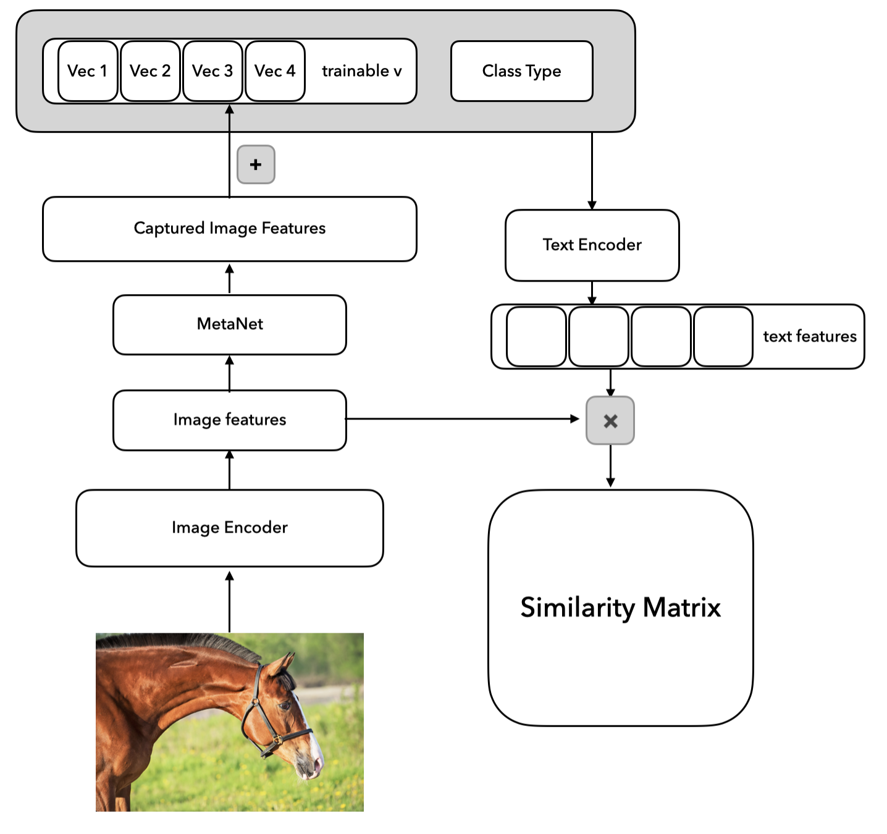
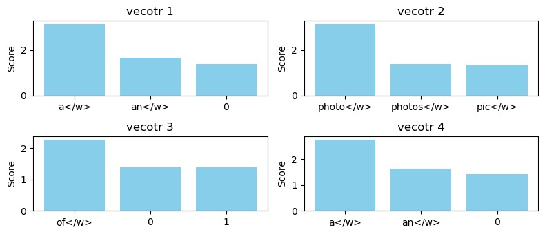

## basic tools 
* [model](https://huggingface.co/distilbert/distilbert-base-uncased/tree/main) then download config.json, pytorch_model.bin, vocab.txt
* put them into one folder and use
```python
import transformers
model  = transfomers.BertModel.from_pretrained('./folder')
tokenizer = transofmers.BertTokenizer.from_pretrained('./folder')
```
## Whole precess
* [database](https://shannon.cs.illinois.edu/DenotationGraph/) it contains Flickr 30k Dataset and the Denotation Graph. Like, Premises: A woman with dark hair in bending, open mouthed, towards the back of a dark headed toddler's head. And image set is just images. But annotated folder is token so we can use 
```python
import pandas as pd
annotations = pd.read_table('results_20130124.token', sep='\t', header=None,
                            names=['image', 'caption'])
print(annotations['caption'])
```
### CLIP 
* Text part: use DistilBert to get the text feature
* Image part: use resnet50 to get the image feature
### CoOp
* automatically adjust the prompt vector embedding base on 'a photo of' (here as an example). 
### CoCoOp
* get the image features and input them input the metanet to add current image information to text embedding to get better generalization ability.

* the input is a Template 'a photo of a {class}', we convert the first four characters into $[v_1][v_2][v_3][v4]{class} $ and train that vecotor to find out the best prompt template for dataset.

# TODO
* add CoCoOp part the enhance the generalization ability of CoOp
* use Open-AI Official API to get better baseline of CLIP 
